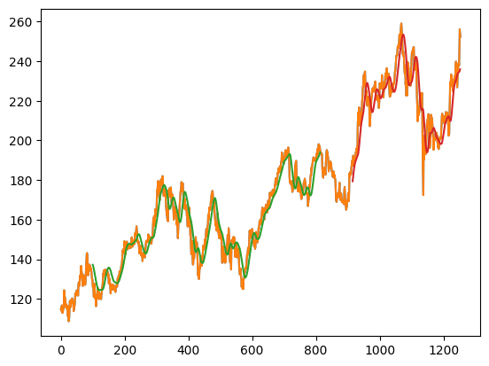

# Stock Price Prediction using LSTM

## Project Overview
This project demonstrates how to predict future stock prices using a deep learning model. It utilizes a Long Short-Term Memory (LSTM) recurrent neural network, which is well-suited for time series forecasting tasks due to its ability to capture long-term dependencies in sequential data. The project involves data fetching, preprocessing, model training, and visualization of the results.

## Key Technologies
* **pandas-datareader**: Used to fetch real-time stock data from the Tiingo API.
* **Pandas**: For data manipulation and analysis.
* **Numpy**: For numerical operations, especially with arrays.
* **Scikit-learn**: The `MinMaxScaler` is used to normalize the data, which is crucial for LSTM performance.
* **TensorFlow/Keras**: The core framework for building and training the LSTM model.
* **Matplotlib**: Used for visualizing the stock data and the model's predictions.

## Model Architecture
The model is a stacked LSTM network, which means it consists of multiple LSTM layers. This architecture allows the model to learn more complex features from the input data.

* **Input Layer**: Takes a sequence of 100 time steps as input.
* **Two Stacked LSTM Layers**: Each with 50 neurons and `return_sequences=True` to pass the full sequence to the next layer.
* **Final LSTM Layer**: Also with 50 neurons, but `return_sequences=False` as it is the last LSTM layer before the output.
* **Dense Output Layer**: A single neuron with a linear activation function to predict the single next stock price value.
* **Optimizer**: The model is compiled with the `Adam` optimizer.
* **Loss Function**: `mean_squared_error` is used, a standard choice for regression problems.

## Data and Preprocessing
The model fetches stock data for a user-specified symbol. The closing prices are then extracted and scaled using `MinMaxScaler` to a range of [0, 1]. The dataset is split into training (65%) and testing (35%) sets. A custom function `create_dataset` reshapes the data into input sequences (X) and corresponding labels (Y) for the LSTM model.

## Results
The model's performance is evaluated using the Root Mean Squared Error (RMSE) on both the training and testing data. The predictions are visualized against the actual stock prices to show how well the model is performing.

### Future Price Prediction
The model is also used to predict the next 30 days of stock prices based on the most recent data.

*This plot shows the end of the historical stock data and the model's forecast for the next 30 days.*

## Usage
1.  **Get an API Key**: Sign up for a free API key from the Tiingo website.
2.  **Install Libraries**: Ensure you have all the necessary libraries installed (`pandas`, `pandas-datareader`, `tensorflow`, `matplotlib`, `scikit-learn`).
3.  **Update API Key**: Insert your API key into the script.
4.  **Run the Script**: Execute the Python script and enter the stock symbol you want to analyze.
5.  **View Results**: The script will generate plots showing the model's performance and future price predictions.
